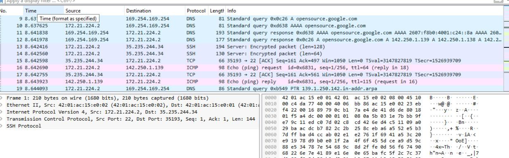
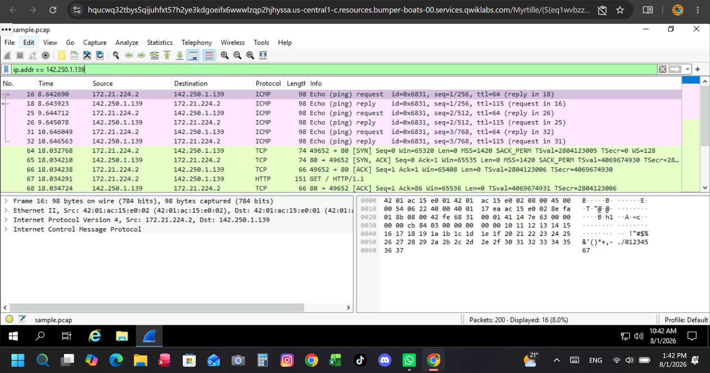
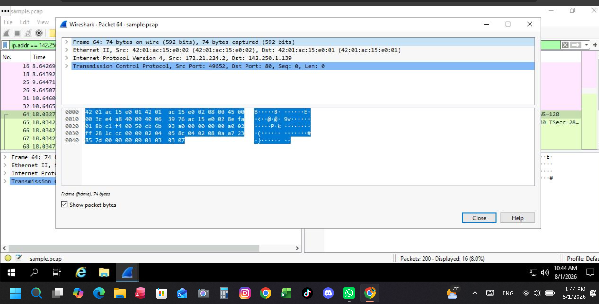
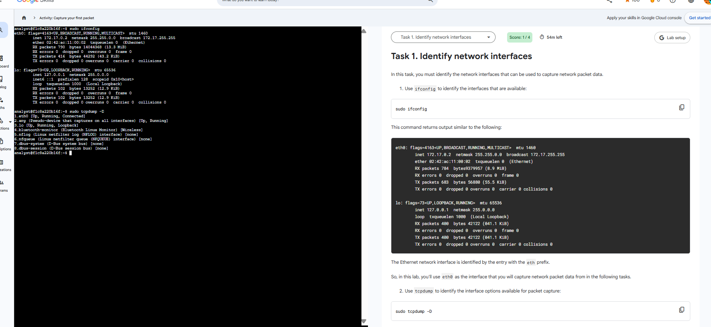
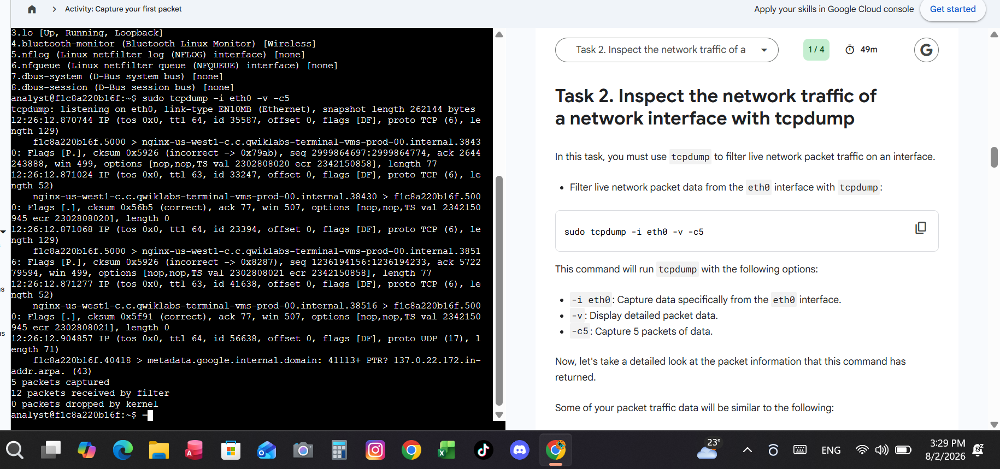
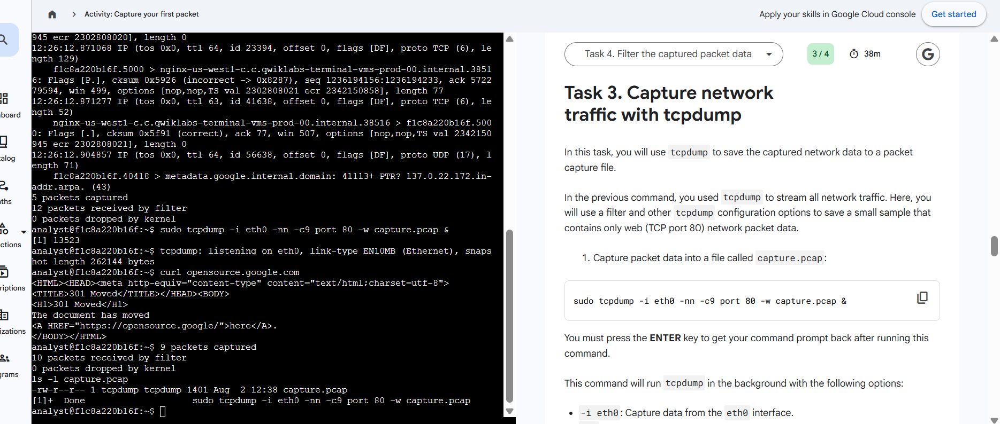
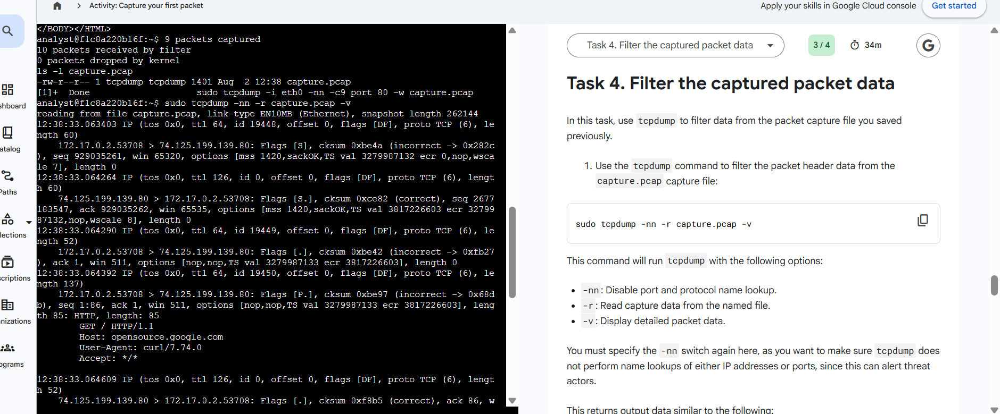

# Course 6: Detection & Incident Response Practical Labs

Welcome to the Detection & Incident Response module documentation. This page contains hands-on analysis labs covering GUI-based network inspection using **Wireshark** and command-line traffic capture using **tcpdump**.

---

## 🦈 Part 1: Network Traffic Analysis & Packet Inspection with Wireshark

### 🎯 Overview
In this practical lab, I performed network packet capture analysis using Wireshark. I applied display filters to inspect IPv4, TCP, UDP, and DNS traffic, isolating specific IP addresses and analyzing packet headers to investigate network activity.

### 🔑 Key Display Filters Used
| Protocol / Target | Wireshark Display Filter | Purpose |
| :--- | :--- | :--- |
| **IP Filtering** | `ip.addr == 142.250.1.139` | Isolates all traffic to/from Google's server IP |
| **DNS Traffic** | `udp.port == 53` | Filters DNS queries and domain name resolutions |
| **TCP Traffic** | `tcp.port == 80` | Filters standard unencrypted web traffic |

### 🔍 Key Investigations & Findings

#### 1. Explore Data with Wireshark
In this task, I opened the sample packet capture file and navigated the core Wireshark interface.
* **Interface Navigation:** Examined captured packets using Protocol, Length, and Info columns.
* **Visual Classification:** Observed Wireshark's default coloring rules to quickly differentiate traffic types.
* **Protocol Identification:** Navigated the packet list to identify ICMP as the protocol used for Echo (ping) requests.

---

#### 2. IP Address Filtering & Analysis
Using `ip.addr == 142.250.1.139`, I isolated all network communication (ICMP echo requests/replies and TCP traffic) sent to and from Google's server IP.

---

#### 3. Frame & Encapsulation Inspection
Using `ip.addr == 142.250.1.139`, I inspected Frame 64 packet details to analyze TCP payload encapsulation and protocol headers.

---

## 💻 Part 2: Capturing & Filtering Network Traffic with tcpdump

### 🎯 Overview
In this practical lab, I used `tcpdump` in Linux to identify active network interfaces, capture live packet data directly to a `.pcap` file, and apply command-line filters to analyze specific network traffic.

### 🔍 Lab Execution & Proof

#### 1. Identify Network Interfaces
Inspected available interfaces using `ifconfig` and identified active capture interfaces with `sudo tcpdump -D`.

---

#### 2. Inspect Live Traffic
Captured live packet headers on `eth0` with detailed verbosity using `sudo tcpdump -i eth0 -v -c5`.

---

#### 3. Capture Traffic to PCAP File
Saved web packet traffic (TCP port 80) directly to a capture file using `sudo tcpdump -i eth0 -nn -c9 port 80 -w capture.pcap`.

---

#### 4. Filter Captured Packet Data
Read and filtered the saved `.pcap` file to analyze HTTP request details using `sudo tcpdump -nn -r capture.pcap -v`.

---

## 🛠️ Summary of Skills Demonstrated
* **GUI Packet Analysis:** Wireshark display filters, frame decoding, protocol header inspection.
* **CLI Network Analysis:** Command-line packet capture with `tcpdump`, `.pcap` logging, syntax-based packet filtering.
* **Traffic Isolation:** Filtering targeted IP addresses, ports, and protocols across both graphical and terminal interfaces.
