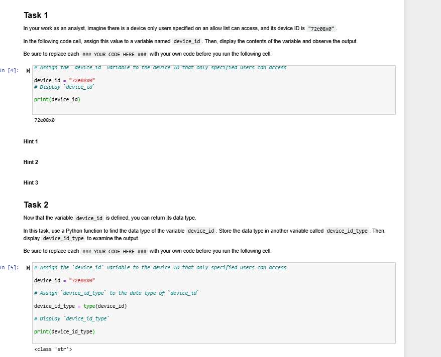
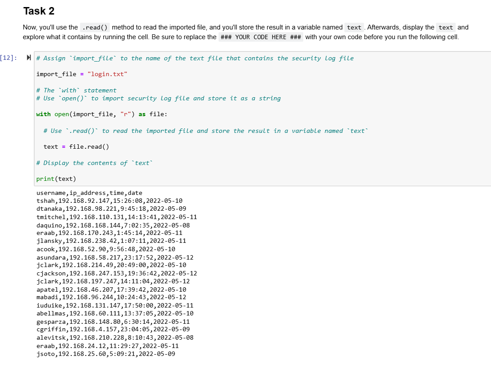
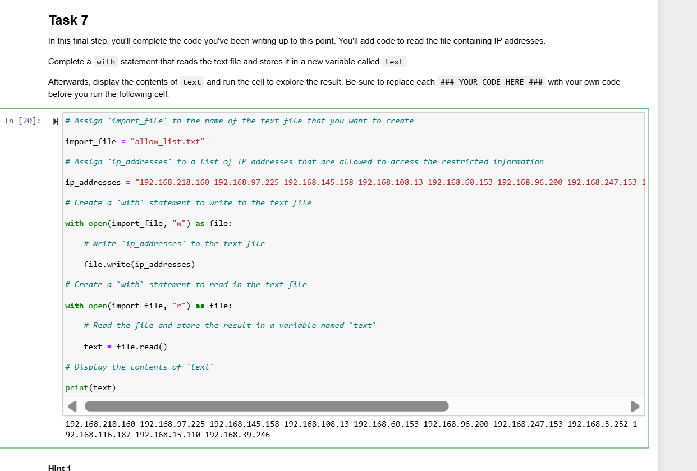
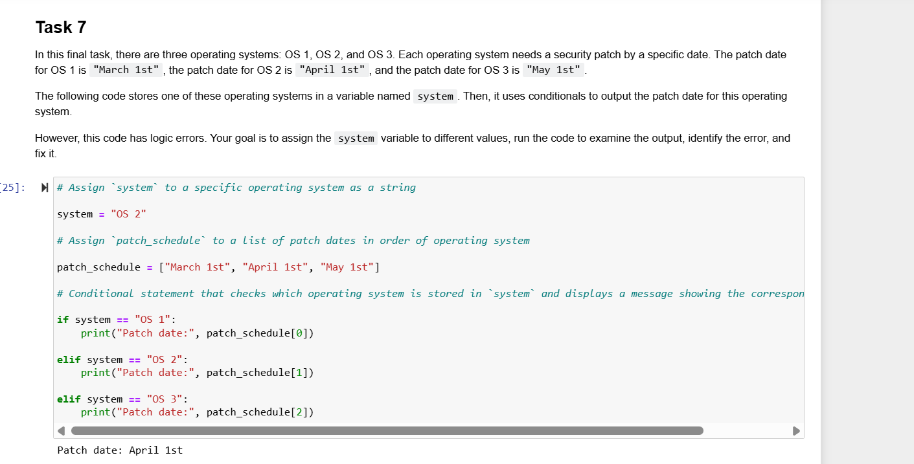

# Course 7: Automating Cybersecurity Tasks with Python

Welcome to the Python automation module documentation. This page details hands-on algorithms written to parse log files, verify user authorization, and update IP allow lists.

## 🐍 Python Lab Workflows & Code Analysis

### 1. Device ID Verification
* **Objective:** Check if a device ID matches expected formatting and data types.

### 2. Security Log Parser & Reader
* **Objective:** Read log files using `with open()` and extract contents for security auditing.

### 3. Automated OS Patch Scheduler
* **Objective:** Automate update schedules across multiple operating system builds.

